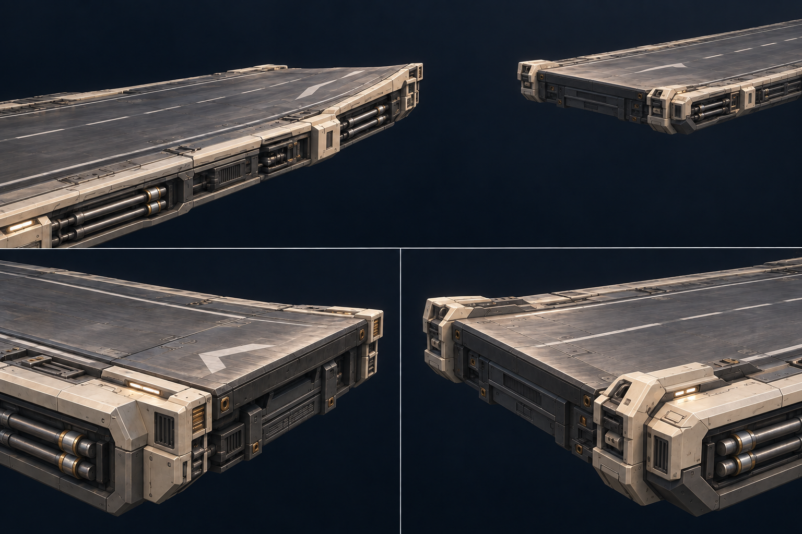

# Gap edge concept — angle and mechanical detail

Generated with the built-in image_gen tool on 2026-09-25. Concept reference only; not an implemented or approved model. The user requested slight opposing angles and richer detail after finding the first flat lips too plain.

Direction to explore: approximately 3° over a 12 m end section, raised gap-facing lips, chamfered ivory corner pieces, layered front plates, visible recessed pipe bays and fewer broad directional markings. The actual angle must be authored explicitly in geometry; this perspective concept is not a dimensional drawing. Keep machinery exposed and deck thickness shallow. Gameplay surface/collision alignment needs to be handled with the eventual angled model.

## Generation prompt

Use case: stylized-concept.
Asset type: actionable 3D game environment concept reference for a futuristic hover-racing track's takeoff and landing modules.
Create a beautifully composed landscape concept sheet, with one large three-quarter perspective view across a broken straight track and two smaller close-up panels below showing the takeoff edge and the landing edge. No labels or text needed. The design is the hero, no ship, people or interface.
The track is broad, 36 metres wide, suspended against a near-black navy void. There is a substantial empty jump gap, with separate near takeoff deck and far landing deck, absolutely no bridge or cable across the opening. Each detailed end module extends about 12 metres back along its own road. Takeoff gently rises toward the cut edge at approximately three degrees, a shallow integrated wedge rather than a steep stunt ramp. The far receiving lip is slightly elevated at the gap and slopes gently down into its landing road. Keep both subtle matching angles clearly legible in silhouette.
Style: refined hard-surface game concept art, grounded industrial sci-fi, buildable modular geometry, clean broad silhouettes with purposeful recessed detail; visually richer than a greybox but not a tangled photoreal greeble sculpture.
Materials: dark graphite brushed metal road slabs with varied polish and soft grazing specular reflections; warm off-white/ivory structural edge armor; charcoal cavities; muted steel and tiny restrained brass fasteners. No saturated colored road lane. Neutral white markings only.
Design: integrate broad asymmetric inset plates, chamfered stepped ivory shoulders, long recessed service channels at the outer thirds, visible paired conduits with machined collars and capped ends, slotted cooling inserts, captive fasteners, dark rubber expansion seams. Keep a broad central running surface smooth and uncluttered for a hovering vehicle. Use alternating broad quiet plates and a few readable mechanical apertures, with detail mostly sunk below the road. The gap-facing cut exposes approximately one metre of convincing layered deck thickness: upper and lower flanges, recessed segmented web, structural end cheeks, and sealed service connections. Do not add a bulky hidden undercarriage. Give takeoff a small number of broad broken white directional marks integrated into panels; give landing an identifiable calmer set of ivory receiving brackets. Avoid dense repetitive rows of tiny painted dashes. Keep the machinery localized and visible, not buried behind opaque armor.
Lighting: broad warm neutral grazing highlights and soft cool fill reveal the metal grain and beveled edges. Readable dark recesses. Restrained cinematic presentation without fog obscuring parts.
Composition: the large view clearly shows BOTH angled lips and the open gap; close-up panels let a modeler study the plate layering and actual mechanical joints. The three views must depict one consistent design. No yellow translucent jump guides, arrows floating in air, HUD, glowing road carpets, laser beams, giant portal, spikes, excessive rust, wreckage or giant rails.

## Refinement prompt

Refine this exact concept sheet, preserving the same three-panel composition, graphite brushed metal and ivory materials, gap, industrial front-edge cap details and high quality. Make two connected corrections: remove ALL tall downward-sloping support walls, huge underside structures and towers behind the decks. Both road ends should be shallow floating decks about 0.9 to 1.2 metres thick, with just the detailed exposed end fascia and short visible side returns. Empty navy void below them, no deep chassis. Then make the end modules gently angled: near takeoff road ramps upward toward its gap-facing lip by approximately 3 degrees over a broad 12 metre apron, while the far landing's gap-facing lip is gently raised and descends away from the gap into its road. These are slight integrated wedges, not steep ramps. Show this subtle angled profile clearly in the large overview and retain the mechanical close-ups. Keep the overall road surface clear and smooth, broad broken white directional markings, recessed fittings and restrained neutral service lights. No text, HUD or yellow overlays.

