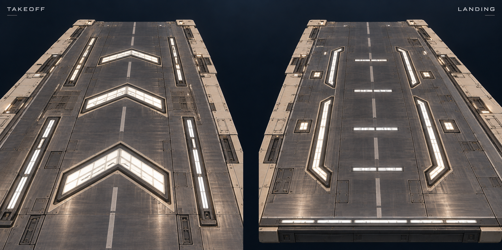

# Gap top-surface energy concept — V2

Generated using the built-in image_gen tool on 2026-09-25. The user corrected the previous concept: focus on top-surface light/energy fixtures, not sides or edges; the landing edge may remain useful. This supersedes V1. The user selected the embedded arrows and bright end strip and requested both models be rebuilt. The R2 model implementation is now delivered for review; see [current gap study](11-flat-gap-study-r1.md).

Takeoff: large segmented recessed light chevrons and parallel light channels. Landing: receiving brackets, transverse light inserts and a visible leading edge. Neutral pearl-white energy fixtures distinguish these from saturated gameplay phase lanes. Exact dimensions and the earlier proposed shallow angles still require geometry authoring; this is an inspiration image, not a measured drawing.

## Final prompt

Create a NEW top-surface-focused concept sheet for a futuristic hover-racing game's takeoff and landing modules. Use the supplied concept ONLY as a graphite metal / warm ivory material reference. Completely change the viewpoint and focus: the user does not want side machinery or edge details to be the main subject.

Landscape image with TWO LARGE equal panels: left shows the TAKEOFF top surface from a shallow overhead chase-camera-like viewpoint approaching its gap; right shows the LANDING top surface from an elevated approach across the gap. Each panel must show the broad 12-metre-long apron and at least 85 percent of visible deck area should be TOP SURFACE. Very little sidewall, no machinery showcase or underside close-ups. Small clean labels 'TAKEOFF' and 'LANDING' permitted.

Maintain a 36m wide road made of graphite brushed metal slabs with soft specular reflections and occasional inset ivory replacement panels. Add strong, readable luminous top-surface design, not just more bolts or paint:
TAKEOFF: three large staggered directional light assemblies built into recessed channels across the central and outer portions of the deck. Use broad swept chevron shapes assembled from segmented pearl-white emissive glass inserts, backed by charcoal troughs and chamfered ivory bezels. Fine internal emitter cells are visible within each larger light insert. Pair the chevrons with two long recessed energy conduits that guide the eye toward the gap and terminate before the edge. Have purposeful asymmetry in service access plates between the lit elements. Glow should be restrained but clearly visible from gameplay distance, lighting the neighboring brushed metal.
LANDING: a distinctive welcoming arrangement of long inset luminous receiving brackets, short transverse segmented light bars, and sparse illuminated service tiles. Give it a calmer broad rhythm than the takeoff, directing the eye away from the gap into the road. The landing's front edge may have one thin luminous strip to help visibility, but the main detail remains on TOP.
All emitters are physical recessed fixtures with depth, opaque framing, readable panel seams and a clear optical cover; no floating holograms, no light projected as a solid carpet over the road. Keep the central surface safe and clear for a ship that hovers: almost all equipment lies below the nominal surface. The end modules can have a subtle three-degree rise/fall but no steep ramps.
Palette: dark graphite, ivory construction, luminous pearl white with a slightly cool core and soft warm-neutral reflections. Reserve saturated cyan, amber and violet for the game's phase lanes; do not turn the entire deck into a colored lane. Don't use a large yellow filled arrow or yellow overlay. Luminous chevrons should have DARK EMPTY SPACE inside them, not filled arrow carpets.
Style: polished, buildable 3D hard-surface game concept art, strong broad geometric light motifs supported by smaller recessed mechanical detail, enough contrast to be recognized at high speed. Dark navy void beyond the cut. No ship, HUD, towers, giant rails, deep chassis, side pipe hero views or detailed underside. This is about TOP-SURFACE energy fixtures and their reflections.
