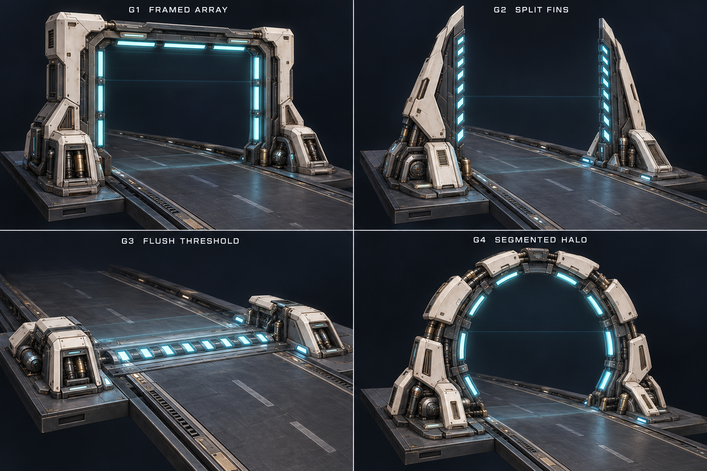
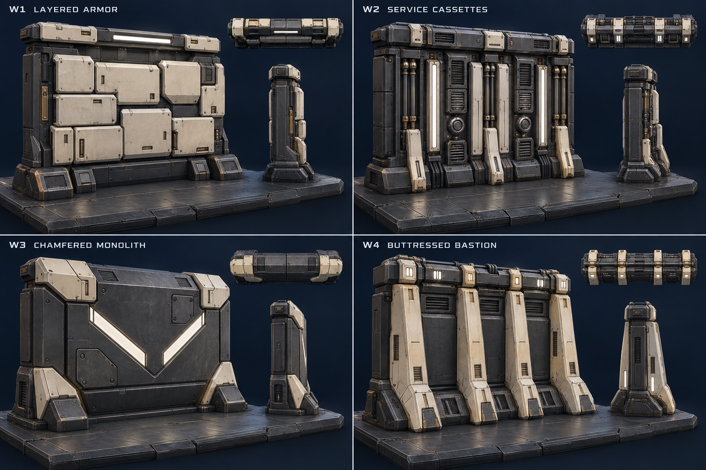
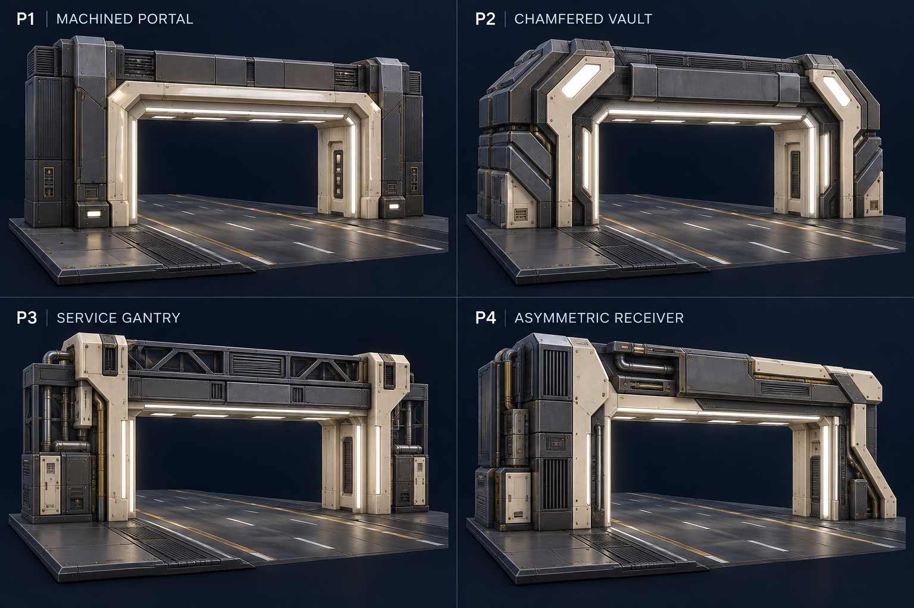
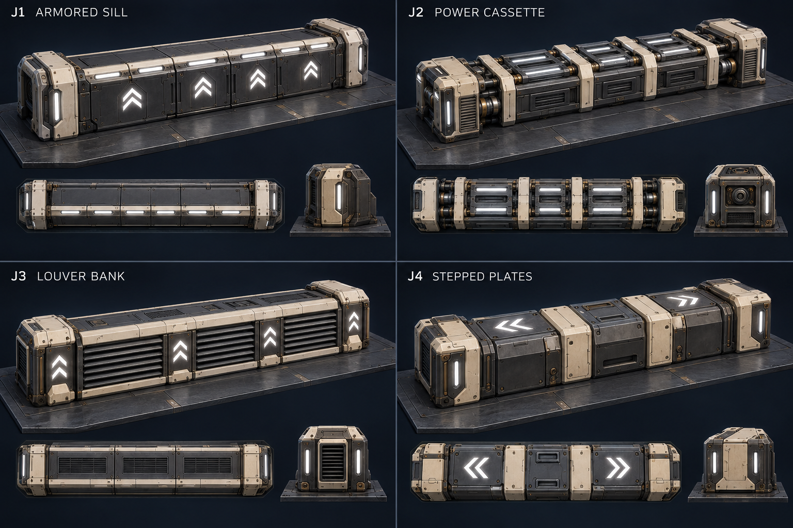

# Phase 12 — obstacle concept alternatives

User requested a concept selection stage before modeling, after approving phase 11. Generated with the built-in image_gen tool. Four comparison boards explore sixteen alternatives. These are visual ideas, not final mesh or collision specifications. No phase 12 models or gameplay changes are part of this pass.

User selections, 2026-09-25: **G2 Split fins**, **W4 Buttressed bastion**, **P3 Service gantry**, **J3 Louver bank**. The user stopped the later assembly-concept direction and requested progressive iteration on actual geometry, starting with repeatable W4 walls on flat road and both tube surfaces. See [modeled walls R1](12-walls-r1.md). The exploratory assembly sheet does not establish an approved tube layout for the other element families.

| Type | Alternatives |
| --- | --- |
| Phase gates | G1 framed array · G2 split fins · G3 flush threshold · G4 segmented halo |
| Solid walls | W1 layered armor · W2 service cassettes · W3 chamfered monolith · W4 buttressed bastion |
| Passage frames | P1 machined portal · P2 chamfered vault · P3 service gantry · P4 asymmetric receiver |
| Low jump barriers | J1 armored sill · J2 power cassette · J3 louver bank · J4 stepped plates |

All gates use cyan for comparison; selected emitter hardware will support cyan, amber and violet. Solid obstacles use neutral pearl-white lights. Passage concepts preserve a clear rectangular route; jump barriers remain low solid obstacles. Final modeling must respect the existing collision dimensions and surface profiles.

All four boards are generated and saved alongside this document. The images include useful extra top/end views on the wall and barrier boards. Preserve the rectangular passage clearance behind decorative frames and keep jump guidance aligned with travel.

## Phase gates



## Solid walls



## Passage frames



## Low jump barriers



## Next step

Latest direction: W4 walls R2 and P3 passages R1 are approved. The user replaced G2 with a combination of F1 cable manifolds and F2 capacitor banks from the [new emitter concepts](12-phase-emitters-concepts-r1.md). The [recessed emitter set R1](12-phase-emitters-r1.md) is modeled on flat, inside and outside surfaces with live phase recoloring and awaits user review.

Current direction: build and iterate one element family at a time in actual modeled geometry. W4 walls come first on flat, inside and outside road surfaces. Gate, passage and low jump-barrier modeling will follow later user direction; do not extrapolate those tube layouts from the interrupted assembly-concept pass.

Current gameplay supports an offset passage: the opening occupies its specified lateral interval, the remaining track width is solid wall, and a lintel blocks above the clear opening. A standalone solid wall blocks only its specified interval, leaving a steering bypass. P3 is a physical passage, not a phase gate; G2 is the separate color-matching gate.

## Exact generation prompts

### Phase gates

```text
Use case: stylized-concept.
Create a high-quality landscape 3D hard-surface game art concept comparison board for a futuristic hover-racing track, with FOUR large equally sized panels in a clean 2 by 2 grid. Each panel shows ONE distinctly different alternative, not recolors. Label each with the exact short ID and title specified below in restrained legible white typography above its image. Make each asset large enough to study its construction, completely in frame with generous margins. Similar scale and slightly elevated approach/front three-quarter camera in all panels; show front, top and one side, not tiny distant road scenes.
Art direction shared across all four: engineered graphite brushed metal, warm ivory segmented armor, machined steel, occasional muted brass connectors, physically inset service wells, panel seams, fasteners, pipe couplings and cooling louvers. Broad readable forms first, fine detail second. Controlled metallic reflections and soft pearl-white optical fixtures physically embedded in bezels. Dark navy void background, short dark plated road plinth beneath each asset, believable soft studio/game lighting, subtle glow without hiding geometry. Finished buildable game concept art, not wireframes or debug graphics. No ships, people, HUD, weapons, logos, landscapes, floating labels across geometry or decorative holograms. Strong variety in massing, frame construction, light motif and panel rhythm while belonging to one kit. Do not add construction dimensions or tiny explanatory text. Concept art for choosing and mixing ideas before modeling; not final collision geometry.

Subject: pass-through PHASE GATES, physically open racing checkpoints with color-selectable emitter hardware. Use CYAN for all four concepts so silhouette differences can be judged independently of color; the same hardware will later support cyan, amber and violet. Only the emitters and a very faint translucent scan plane have cyan light; ivory/metal structure remains neutral. Road and view beyond the gate are clearly visible. No opaque blocking walls, no low crossbar across the flight opening.
Four alternatives:
"G1  FRAMED ARRAY": squared heavy ivory portal with inset graphite beam, broad segmented cyan emitter bars lining inner posts and header, exposed recessed power modules at the bases, clean rectangular opening.
"G2  SPLIT FINS": no overhead crossbeam. Two separate swept, tapered blade-like emitter pylons framing a broad clear road, stacked cyan optical slits down their inward faces, angular shield plates, asymmetric service access on bases. Tall assertive vertical silhouette, clearly different from G1.
"G3  FLUSH THRESHOLD": low architecture, no tall posts or arch. A broad recessed transverse emitter strip built into road, bracketed by short shoulder pods, repeated cyan light cartridges and two compact mechanical end blocks. Give floor engineering, inset lenses and power housings enough detail; do not turn it into a giant luminous carpet.
"G4  SEGMENTED HALO": faceted near-circular open portal on low footings, articulated ivory arc cartridges around graphite frame with cyan inner emitter segments, gaps between outer armor plates revealing connectors. Clear central passage. Arc modules could also follow a tube surface.
Show real variety and convincing power supply architecture rather than four generic glowing rectangular arches.
```

### Solid walls

```text
Use case: stylized-concept.
Create a high-quality landscape 3D hard-surface game art concept comparison board for a futuristic hover-racing track, with FOUR large equally sized panels in a clean 2 by 2 grid. Each panel shows ONE distinctly different alternative, not recolors. Label each with the exact short ID and title specified below in restrained legible white typography above its image. Make each asset large enough to study its construction, completely in frame with generous margins. Similar scale and slightly elevated approach/front three-quarter camera in all panels; show front, top and one side, not tiny distant road scenes.
Art direction shared across all four: engineered graphite brushed metal, warm ivory segmented armor, machined steel, occasional muted brass connectors, physically inset service wells, panel seams, fasteners, pipe couplings and cooling louvers. Broad readable forms first, fine detail second. Controlled metallic reflections and soft pearl-white optical fixtures physically embedded in bezels. Dark navy void background, short dark plated road plinth beneath each asset, believable soft studio/game lighting, subtle glow without hiding geometry. Finished buildable game concept art, not wireframes or debug graphics. No ships, people, HUD, weapons, logos, landscapes, floating labels across geometry or decorative holograms. Strong variety in massing, frame construction, light motif and panel rhythm while belonging to one kit. Do not add construction dimensions or tiny explanatory text. Concept art for choosing and mixing ideas before modeling; not final collision geometry.

Subject: SOLID BLOCKING WALL modules across part of a racing track; each is a thick approximately 7m tall, 10m wide, 5m deep opaque wall with modular base and top cap. Strong unambiguous blocking silhouette. No doorway, tunnel, transparent forcefield, drive-through opening, or glowing phase-color face. Lights are PEARL WHITE only, neutral walls are solid regardless of ship phase. Keep base and top cap clearly legible.
Four alternatives:
"W1  LAYERED ARMOR": broad solid face assembled from offset chunky ivory rectangular armor plates over dark structural paneling, deep recessed seams, small inset service latches and one segmented white crown light. Rugged and calm.
"W2  SERVICE CASSETTES": mostly graphite wall divided into protected recessed vertical machinery cassettes, visibly solid backing, paired conduit couplings, cooling banks and ivory retaining ribs. Use two long narrow white optical channels between machinery groups. Machinery must never look like open routes through the wall.
"W3  CHAMFERED MONOLITH": clean severe faceted obstruction, broad slightly angled graphite frontal face with asymmetric inset repair plates, thick ivory wrapped top shoulders, a large recessed pearl-white broken chevron marking a solid blocked mass. Solid near-vertical front, not a ramp. Different quiet/mechanical density from W1/W2.
"W4  BUTTRESSED BASTION": repeated tall trapezoidal ivory support ribs protruding from an opaque dark wall with wide armored bays between them, deep footings, protected top power spine and short paired white locator lights. Strong alternating depth and silhouette, structurally substantial.
Aim for varied final-art personalities, from quiet armor to mechanical industrial detail. No black-and-yellow construction stripes.
```

### Passage frames

```text
Use case: stylized-concept.
Create a high-quality landscape 3D hard-surface game art concept comparison board for a futuristic hover-racing track, with FOUR large equally sized panels in a clean 2 by 2 grid. Each panel shows ONE distinctly different alternative, not recolors. Label each with the exact short ID and title specified below in restrained legible white typography above its image. Make each asset large enough to study its construction, completely in frame with generous margins. Similar scale and slightly elevated approach/front three-quarter camera in all panels; show front, top and one side, not tiny distant road scenes.
Art direction shared across all four: engineered graphite brushed metal, warm ivory segmented armor, machined steel, occasional muted brass connectors, physically inset service wells, panel seams, fasteners, pipe couplings and cooling louvers. Broad readable forms first, fine detail second. Controlled metallic reflections and soft pearl-white optical fixtures physically embedded in bezels. Dark navy void background, short dark plated road plinth beneath each asset, believable soft studio/game lighting, subtle glow without hiding geometry. Finished buildable game concept art, not wireframes or debug graphics. No ships, people, HUD, weapons, logos, landscapes, floating labels across geometry or decorative holograms. Strong variety in massing, frame construction, light motif and panel rhythm while belonging to one kit. Do not add construction dimensions or tiny explanatory text. Concept art for choosing and mixing ideas before modeling; not final collision geometry.

Subject: PASSAGE OPENING modules in solid racing obstacles. Each design must show an unmistakably OPEN rectangular route, clear road continuing THROUGH it, solid opaque blocking walls on both sides and a real lintel overhead. The opening is wide and low, roughly 8m wide by 3.5m clear height, within a larger roughly 7m-high wall. No doors, closed shutters, panels, forcefields, dangling machinery or crossbars filling the route. PEARL-WHITE opening trim only; no cyan/amber/violet phase coding. Show jamb depth and protected hardware.
Four alternatives:
"P1  MACHINED PORTAL": crisp rectangular ivory jambs and lintel, deeply stepped chamfered inner reveal with continuous segmented pearl-white receiving light, calm graphite outer wall, small service plates near corners.
"P2  CHAMFERED VAULT": rectangular clear opening preserved but outside of its thick lintel and jamb casings has bevel-cut/octagonal styling, layered dark stepped armor shoulders, isolated broad white corner-bracket lights. Substantial vault-like depth, visibly different from P1.
"P3  SERVICE GANTRY": large rectangular opening under a practical ribbed lintel carried by split ivory side columns, recessed pipes and access cassettes only OUTSIDE the clear route, neutral light bars inset into the inner column faces. Industrial exposed construction with protective frames.
"P4  ASYMMETRIC RECEIVER": rectangular clear route, one side housed in a broad stack of graphite service cabinets and ivory armor, the opposite jamb slender but strongly braced, an offset layered overhead canopy contained above the opening. Long white receiving brackets outline the clear route; asymmetric wall personality but exact clear rectangular path.
Make the opening and solid surrounds readable immediately at racing speed, with high-quality metal materials and sufficient depth.
```

### Low jump barriers

```text
Use case: stylized-concept.
Create a high-quality landscape 3D hard-surface game art concept comparison board for a futuristic hover-racing track, with FOUR large equally sized panels in a clean 2 by 2 grid. Each panel shows ONE distinctly different alternative, not recolors. Label each with the exact short ID and title specified below in restrained legible white typography above its image. Make each asset large enough to study its construction, completely in frame with generous margins. Similar scale and slightly elevated approach/front three-quarter camera in all panels; show front, top and one side, not tiny distant road scenes.
Art direction shared across all four: engineered graphite brushed metal, warm ivory segmented armor, machined steel, occasional muted brass connectors, physically inset service wells, panel seams, fasteners, pipe couplings and cooling louvers. Broad readable forms first, fine detail second. Controlled metallic reflections and soft pearl-white optical fixtures physically embedded in bezels. Dark navy void background, short dark plated road plinth beneath each asset, believable soft studio/game lighting, subtle glow without hiding geometry. Finished buildable game concept art, not wireframes or debug graphics. No ships, people, HUD, weapons, logos, landscapes, floating labels across geometry or decorative holograms. Strong variety in massing, frame construction, light motif and panel rhythm while belonging to one kit. Do not add construction dimensions or tiny explanatory text. Concept art for choosing and mixing ideas before modeling; not final collision geometry.

Subject: LOW JUMP-OVER BARRIERS across a hover-racing road. Each is a broad opaque obstacle around 2.4m tall, 18m wide and 5m deep, with a modular middle and distinct mechanical end caps, continuous low silhouette and clear space ABOVE for jumping. Solid fronts: neither a drive-through gate nor a speed bump, steep launch ramp or tall wall. Show the broad top surface and leading face clearly. Neutral PEARL-WHITE energy fixtures only, no colored phase field. The height of caps stays at the same low profile.
Four alternatives:
"J1  ARMORED SILL": broad low solid beam with rounded/chamfered ivory cap edges, graphite front panels, repeated flush upward chevron-shaped white fixtures on its near-vertical face and segmented lights along the top leading edge. Quiet armored form.
"J2  POWER CASSETTE": low graphite base with recessed power cartridges across a broad horizontal top, paired white light rails and ivory segmented braces, visible end couplings and capped conduits contained inside robust end blocks. Detailed but all machinery protected below the top envelope.
"J3  LOUVER BANK": low wide modular solid barricade with opaque dark backplate behind slanted cooling louvers across the front, thick ivory top and base strips, luminous white upward bracket motifs at intervals. Readable horizontal fins and cooling-industrial personality.
"J4  STEPPED PLATES": broad square-edged low obstruction made from alternating inset graphite armor and ivory repair slabs, asymmetric top access hatches, large recessed white double chevrons on the broad top and short lit end-cap pockets. NO ramp slope, silhouette remains a box-shaped jump-over obstacle.
These four alternatives must have distinct construction and light placement, not four small variations of one beam.
```

