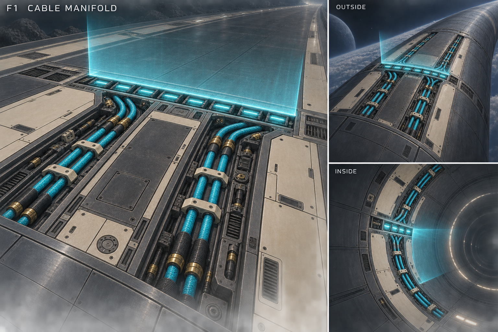
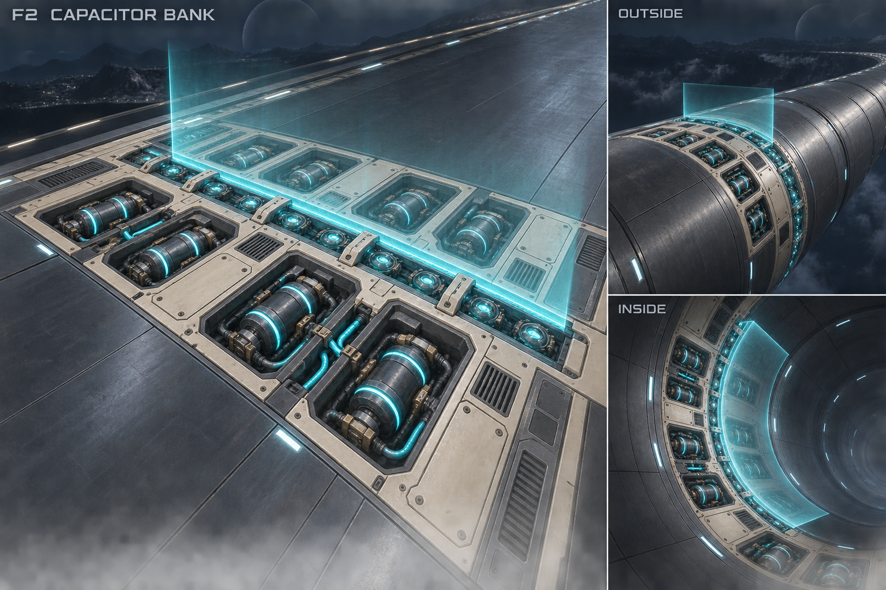
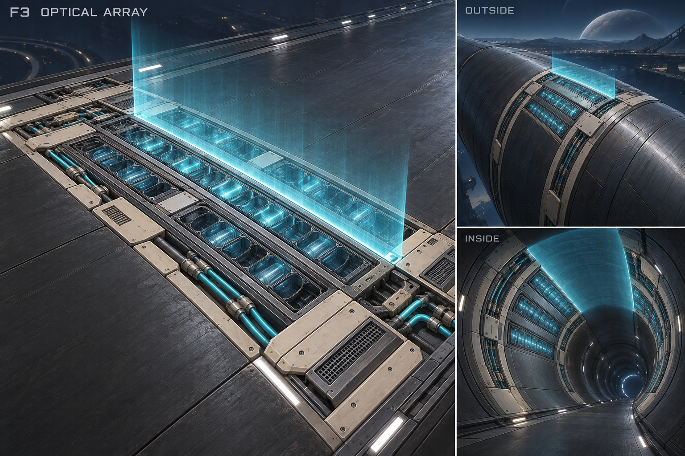

# Phase gates — recessed emitter concepts

Selection: the user approved combining F1 and F2. [First modeled set](12-phase-emitters-r1.md) adds dynamically colored cables, capacitor bands, lenses and projection materials.

The user approved P3 passages and requested a new gate direction: ground-based elements that project light, broad enough to read at racing speed, with colored charging-cable strips and deep mechanical detail. Tall G2 fins are being reconsidered because physical posts would obstruct tube driving.

Generated with the built-in image_gen tool. Each board explores one alternative with a large flat-road detail view and smaller outside/inside context views. All use cyan for direct form comparison; any selected design must also support amber and violet.

- **F1 Cable manifold:** long cable feeders, combs and connector sockets feeding a transverse projector trench.
- **F2 Capacitor bank:** staggered recessed power cells, busbars and short cable loops feeding an optical seam.
- **F3 Optical array:** broad recessed lens beds, optical louvers and quieter armor intervals with cable channels.

The proposed hardware station is approximately 12 m long along travel, echoing the approved readable service-section length. The actual gate crossing remains a clearly marked transverse projection within that zone. This is a concept proportion, not a gameplay timing change. All physical components should sit below the nominal driving skin on flat and curved surfaces. Only projected light occupies the flight path.







No gate geometry or gameplay changes in this pass. Concepts await user selection; the earlier rejected assembly sheet does not define these layouts. The generated tube insets communicate the surface treatment, but their partial rectangular light curtains are illustrative. A full-circumference gate would require a radial projection following the tube, resolved during geometry implementation.

## Exact generation prompts

### F1 Cable manifold

```text
Use case: stylized-concept.
Create a detailed polished hard-surface game concept board for a GROUND-EMBEDDED PHASE GATE in a futuristic hover racer. New art direction: absolutely NO posts, pylons, fins, arches, rails or other hardware above the nominal racing surface. All machinery, cables, power modules and optical emitters are recessed into deep machined wells. Only projected light extends above the road. A hovercraft must be able to skim across the entire road/tube circumference without striking hardware.
Composition: landscape board with a LARGE hero occupying the left two-thirds, showing a FLAT road's broad embedded gate zone from close elevated approach three-quarter view, readable deep recesses and construction. Right third has TWO stacked smaller context panels: upper OUTSIDE TUBE, lower INSIDE TUBE. Label the hero with the specified concept ID/title, and the context panels exactly "OUTSIDE" and "INSIDE". No extra text or measurements. Keep the whole gate visible with margins and show sufficient surrounding ordinary road to read the flush mounting. This is rendered concept art, not diagrams or existing gameplay.
All three panels show the SAME hardware language on different surfaces. The gate occupies a broad approximately 12-metre-long station along travel, spanning the road width; on tubes it wraps around the circumference as a broad flush service band. This generous length is important for visibility at racing speed. Build a clear TRANSVERSE gate station, NOT an ordinary longitudinal boost lane.
Project a thin, visibly luminous but largely TRANSPARENT CYAN scan curtain upward from a transverse row of inset lenses at one clearly defined station within the broad zone. The road remains visible through it. On the outside tube light projects away from the curved outer skin; inside it projects toward the bore. No opaque glowing wall and no beams resembling solid bars. A readable illuminated origin line should distinguish the actual crossing plane from the surrounding power feed.
Deep detail: warm ivory segmented armor frames with bevels, dark graphite brushed metal, machined steel couplings, muted brass clips, layered cavity walls, bolted service access, cooling passages, segmented optical covers. CYAN phase-colored insulated or luminous charging cable runs are important: routed visibly through channels, with bends, cable combs, strain-relief boots and termination sockets; keep their highest points below the road plane. Some neutral metal/ivory plates remain between wells for broad calm readable structure. Restrained specular reflections, soft cyan light on nearby metal, dark navy surroundings. Detail should be rich but plausible to model.
Context geometry: OUTSIDE clearly shows the driving surface on the crown of a SOLID cylindrical tube extending away, no road bridge or driving inside the pipe. INSIDE clearly shows a continuous concave tunnel lining with the flush station all around it; empty open bore with no obstruction. Same conforming parts and same 12m station length, no tall emitter hardware.
No ships, people, HUD, weapons, logos, warning stripes, large floor arrows, tall physical barriers, levitating machinery, architectural portals or raised cable bundles. Use cyan on ALL concepts so form can be judged independently; eventual hardware supports cyan, amber and violet phases.

Hero label: "F1  CABLE MANIFOLD".
Make this alternative strongly cable-driven. Two broad recessed cable trenches lead longitudinally into a transverse emitter trench. Each feeder trench contains three thick cyan-jacketed braided charging cables with visible dark segmented sleeves and brass connector collars, tied down in repeating ivory cable combs. At the transverse crossing, cables fan through armored bend channels into a long array of large rectangular recessed projector windows. Alternating broad ivory service plates flank these trenches. The actual gate projection is a clean thin cyan plane issuing from the transverse optical array. Worn brushed access hatches, small valves and removable cartridge sockets create substantial detail. Clear long approach feeders, substantial transverse hardware, organized rather than chaotic cable spaghetti.
```

### F2 Capacitor bank

```text
Use case: stylized-concept.
Create a detailed polished hard-surface game concept board for a GROUND-EMBEDDED PHASE GATE in a futuristic hover racer. New art direction: absolutely NO posts, pylons, fins, arches, rails or other hardware above the nominal racing surface. All machinery, cables, power modules and optical emitters are recessed into deep machined wells. Only projected light extends above the road. A hovercraft must be able to skim across the entire road/tube circumference without striking hardware.
Composition: landscape board with a LARGE hero occupying the left two-thirds, showing a FLAT road's broad embedded gate zone from close elevated approach three-quarter view, readable deep recesses and construction. Right third has TWO stacked smaller context panels: upper OUTSIDE TUBE, lower INSIDE TUBE. Label the hero with the specified concept ID/title, and the context panels exactly "OUTSIDE" and "INSIDE". No extra text or measurements. Keep the whole gate visible with margins and show sufficient surrounding ordinary road to read the flush mounting. This is rendered concept art, not diagrams or existing gameplay.
All three panels show the SAME hardware language on different surfaces. The gate occupies a broad approximately 12-metre-long station along travel, spanning the road width; on tubes it wraps around the circumference as a broad flush service band. This generous length is important for visibility at racing speed. Build a clear TRANSVERSE gate station, NOT an ordinary longitudinal boost lane.
Project a thin, visibly luminous but largely TRANSPARENT CYAN scan curtain upward from a transverse row of inset lenses at one clearly defined station within the broad zone. The road remains visible through it. On the outside tube light projects away from the curved outer skin; inside it projects toward the bore. No opaque glowing wall and no beams resembling solid bars. A readable illuminated origin line should distinguish the actual crossing plane from the surrounding power feed.
Deep detail: warm ivory segmented armor frames with bevels, dark graphite brushed metal, machined steel couplings, muted brass clips, layered cavity walls, bolted service access, cooling passages, segmented optical covers. CYAN phase-colored insulated or luminous charging cable runs are important: routed visibly through channels, with bends, cable combs, strain-relief boots and termination sockets; keep their highest points below the road plane. Some neutral metal/ivory plates remain between wells for broad calm readable structure. Restrained specular reflections, soft cyan light on nearby metal, dark navy surroundings. Detail should be rich but plausible to model.
Context geometry: OUTSIDE clearly shows the driving surface on the crown of a SOLID cylindrical tube extending away, no road bridge or driving inside the pipe. INSIDE clearly shows a continuous concave tunnel lining with the flush station all around it; empty open bore with no obstruction. Same conforming parts and same 12m station length, no tall emitter hardware.
No ships, people, HUD, weapons, logos, warning stripes, large floor arrows, tall physical barriers, levitating machinery, architectural portals or raised cable bundles. Use cyan on ALL concepts so form can be judged independently; eventual hardware supports cyan, amber and violet phases.

Hero label: "F2  CAPACITOR BANK".
Make this alternative a modular power-storage station, distinct from a cable-trench design. Two staggered rows of deep rectangular ivory-framed wells across a wide 12m station. Each well contains squat cylindrical capacitor cells lying horizontally BELOW THE ROAD, with dark ceramic bodies, cyan luminous insulated bands, recessed metal busbars and clear capped connectors. Some wells instead contain quiet armored access covers. Short thick cyan charging cables loop through submerged channels between capacitor banks and a central transverse emitter seam. Optical projector cartridges run along that seam, separated by ivory mechanical braces. Emphasize the rhythm of many deep replaceable power cells, access latches, cooling louvers and flared cable sockets. Strong broad segmented mechanical silhouette within the surface, never sticking up.
```

### F3 Optical array

```text
Use case: stylized-concept.
Create a detailed polished hard-surface game concept board for a GROUND-EMBEDDED PHASE GATE in a futuristic hover racer. New art direction: absolutely NO posts, pylons, fins, arches, rails or other hardware above the nominal racing surface. All machinery, cables, power modules and optical emitters are recessed into deep machined wells. Only projected light extends above the road. A hovercraft must be able to skim across the entire road/tube circumference without striking hardware.
Composition: landscape board with a LARGE hero occupying the left two-thirds, showing a FLAT road's broad embedded gate zone from close elevated approach three-quarter view, readable deep recesses and construction. Right third has TWO stacked smaller context panels: upper OUTSIDE TUBE, lower INSIDE TUBE. Label the hero with the specified concept ID/title, and the context panels exactly "OUTSIDE" and "INSIDE". No extra text or measurements. Keep the whole gate visible with margins and show sufficient surrounding ordinary road to read the flush mounting. This is rendered concept art, not diagrams or existing gameplay.
All three panels show the SAME hardware language on different surfaces. The gate occupies a broad approximately 12-metre-long station along travel, spanning the road width; on tubes it wraps around the circumference as a broad flush service band. This generous length is important for visibility at racing speed. Build a clear TRANSVERSE gate station, NOT an ordinary longitudinal boost lane.
Project a thin, visibly luminous but largely TRANSPARENT CYAN scan curtain upward from a transverse row of inset lenses at one clearly defined station within the broad zone. The road remains visible through it. On the outside tube light projects away from the curved outer skin; inside it projects toward the bore. No opaque glowing wall and no beams resembling solid bars. A readable illuminated origin line should distinguish the actual crossing plane from the surrounding power feed.
Deep detail: warm ivory segmented armor frames with bevels, dark graphite brushed metal, machined steel couplings, muted brass clips, layered cavity walls, bolted service access, cooling passages, segmented optical covers. CYAN phase-colored insulated or luminous charging cable runs are important: routed visibly through channels, with bends, cable combs, strain-relief boots and termination sockets; keep their highest points below the road plane. Some neutral metal/ivory plates remain between wells for broad calm readable structure. Restrained specular reflections, soft cyan light on nearby metal, dark navy surroundings. Detail should be rich but plausible to model.
Context geometry: OUTSIDE clearly shows the driving surface on the crown of a SOLID cylindrical tube extending away, no road bridge or driving inside the pipe. INSIDE clearly shows a continuous concave tunnel lining with the flush station all around it; empty open bore with no obstruction. Same conforming parts and same 12m station length, no tall emitter hardware.
No ships, people, HUD, weapons, logos, warning stripes, large floor arrows, tall physical barriers, levitating machinery, architectural portals or raised cable bundles. Use cyan on ALL concepts so form can be judged independently; eventual hardware supports cyan, amber and violet phases.

Hero label: "F3  OPTICAL ARRAY".
Make this alternative focused on broad recessed projector beds and a calmer disciplined optical architecture, clearly different from pipes or battery banks. A wide transverse band contains three interlocking rows of oversized cyan optical lens tiles set deeply inside graphite honeycomb/louver wells, with thick chamfered ivory rims. Individual optical tiles have segmented glass, internal reflectors and dark separators. Slim phase-colored charging cables in parallel side channels connect ivory junction blocks to the projector beds; cables have clear couplings, strain relief and restrained bends. Alternating asymmetric ivory maintenance plates and metal grilles provide quiet intervals between the luminous lenses. A central transverse row projects the single thin scan curtain. Rich deep lens mechanisms, shallow service trays and brushed armor, not a flat glowing carpet. Broad readable light motif with controlled bloom.
```

