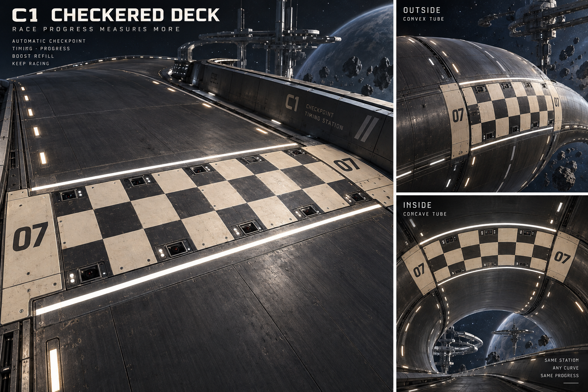
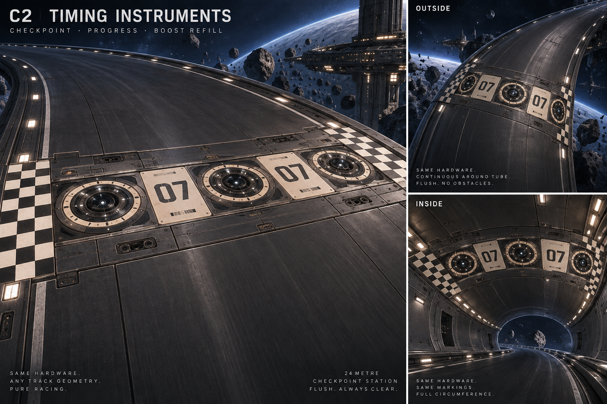
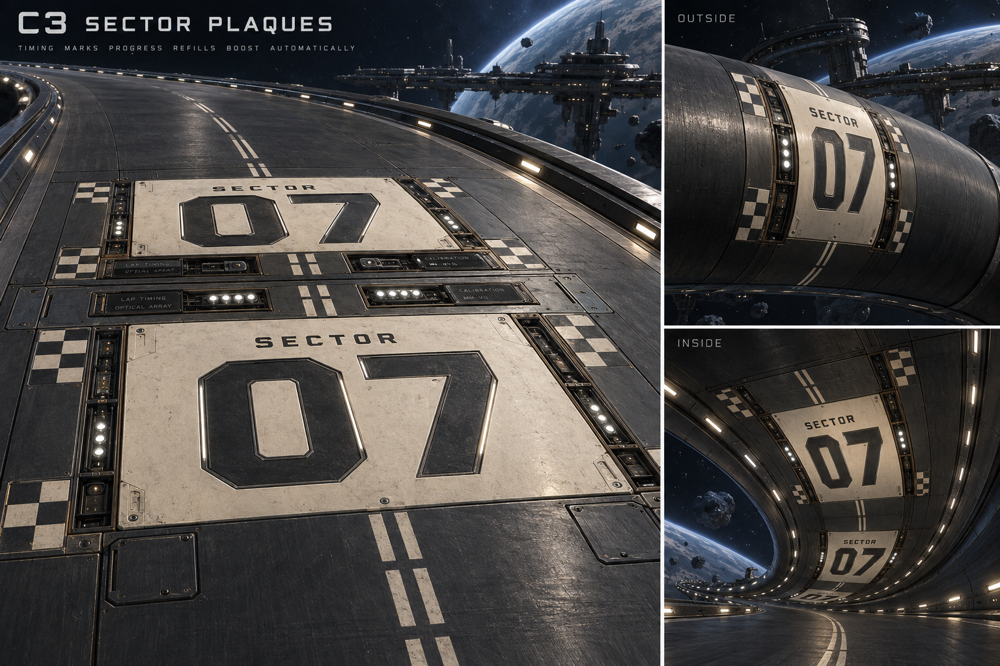

# Phase 13 — checkpoint concept alternatives R1

Selection: the user chose C1 checkers with C2 circular instruments and recessed lamp cassettes, removed all typography, and requested a white crossing curtain with dedicated emitter hardware. This supersedes the original no-curtain exploration constraint. See [modeled checkpoint set R1](13-checkpoints-r1.md).

The user requested checkpoint concept art that translates to flat, inside-tube and outside-tube surfaces while remaining unmistakably distinct from obstacles and phase gates. These are timing stations: bold graphic identity, sector numbers and inset instrumentation. They share the surface mounting method with phase emitters, but not their power machinery or projected curtain.

Generated using the built-in image_gen tool. No geometry or gameplay changes in this concept pass. Selection remains pending. The 24 m length is a proposed readable station footprint.

## C1 Checkered deck



## C2 Timing instruments



## C3 Sector plaques



## Exact generation prompts

### C1 Checkered deck

```text
Use case: stylized-concept.
Create a polished landscape hard-surface concept-art board for a SAFE CHECKPOINT TIMING STATION in a futuristic hover-racing game. This marks progress and automatic boost refill, without a required player action. It must visually read as motorsport timing infrastructure, not a hazard, portal, phase gate or power generator.
Composition: left two-thirds is a large elevated approach three-quarter view of the station on a flat graphite road. Right third has two stacked context views labeled "OUTSIDE" and "INSIDE", showing the SAME hardware and visual markings on the crown of a convex tube and the lining of a concave tunnel. These are continuous tube roads, not flat bridges inside pipes. Show surroundings and clear driving space. Title at top left as specified below.
All physical parts are flush with or recessed BELOW the racing surface. The 24-metre-long station spans the road width; on tubes it forms a broad circumferential band. No obstacle in the flight path anywhere around a tube. Surface markings and numbers repeat around the circumference. Only small inset lamps glow; absolutely NO projected light curtain or holographic wall, no arches, posts, gantries, raised ribs, floating symbols or solid bars over the roadway.
Shared art family: brushed dark graphite, warm ivory ceramic-metal armor, machined steel, restrained brass fasteners, precise bevels, actual inset recesses, subtly worn satin finishes, realistic specular highlights. Rich modeled details: optical timing sensors, fine instrument cartridges, calibration engravings, glass covers, recessed cooling channels, small fasteners, protected connectors, removable service panels. Favor instrumentation rather than exposed heavy machinery. No capacitor cylinders, large charging cables, phase-colored tubes, power-cell trenches, large louver barricades or floor jump arrows.
Checkpoint identity must survive in grayscale: bold racing checker graphics, huge sector numerals, neutral timing lamps and broad uncluttered graphic shapes. Pearl-white lamps only, no cyan, amber, purple, red or green status coding. Calm, inviting and clearly traversable. Keep fine mechanics subordinate to large shapes readable at high speed.
Photorealistic stylized game asset render, restrained bloom, dark navy space setting, no characters, ships, HUD, watermarks or external logos. Render the actual physical station, not a diagram or UI screen. Typography clean and correctly spelled.

Title: "C1  CHECKERED DECK".
A boldly graphic motorsport checkpoint. A broad alternating ivory-and-graphite checkerboard deck, using large rectangular inlaid armor tiles with seams and fasteners, is the dominant form. Six large checks across the road, a few rows along travel, framed by two thin pearl-white transverse timing lines. Broad ordinary graphite road approaches and continues beyond it. A large inlaid "07" appears on ivory identification plates at intervals. Slim recessed timing-sensor cassettes occupy small spaces between the big checks: paired square dark optical glass windows, tiny white calibration LEDs, latch mechanisms. Preserve the huge high-speed-readable checker rhythm; not a grid of glowing tiles. The tube views clearly show the checker belt wrapping around the continuous driving skin, with no physical lip.
```

### C2 Timing instruments

```text
Use case: stylized-concept.
Create a polished landscape hard-surface concept-art board for a SAFE CHECKPOINT TIMING STATION in a futuristic hover-racing game. This marks progress and automatic boost refill, without a required player action. It must visually read as motorsport timing infrastructure, not a hazard, portal, phase gate or power generator.
Composition: left two-thirds is a large elevated approach three-quarter view of the station on a flat graphite road. Right third has two stacked context views labeled "OUTSIDE" and "INSIDE", showing the SAME hardware and visual markings on the crown of a convex tube and the lining of a concave tunnel. These are continuous tube roads, not flat bridges inside pipes. Show surroundings and clear driving space. Title at top left as specified below.
All physical parts are flush with or recessed BELOW the racing surface. The 24-metre-long station spans the road width; on tubes it forms a broad circumferential band. No obstacle in the flight path anywhere around a tube. Surface markings and numbers repeat around the circumference. Only small inset lamps glow; absolutely NO projected light curtain or holographic wall, no arches, posts, gantries, raised ribs, floating symbols or solid bars over the roadway.
Shared art family: brushed dark graphite, warm ivory ceramic-metal armor, machined steel, restrained brass fasteners, precise bevels, actual inset recesses, subtly worn satin finishes, realistic specular highlights. Rich modeled details: optical timing sensors, fine instrument cartridges, calibration engravings, glass covers, recessed cooling channels, small fasteners, protected connectors, removable service panels. Favor instrumentation rather than exposed heavy machinery. No capacitor cylinders, large charging cables, phase-colored tubes, power-cell trenches, large louver barricades or floor jump arrows.
Checkpoint identity must survive in grayscale: bold racing checker graphics, huge sector numerals, neutral timing lamps and broad uncluttered graphic shapes. Pearl-white lamps only, no cyan, amber, purple, red or green status coding. Calm, inviting and clearly traversable. Keep fine mechanics subordinate to large shapes readable at high speed.
Photorealistic stylized game asset render, restrained bloom, dark navy space setting, no characters, ships, HUD, watermarks or external logos. Render the actual physical station, not a diagram or UI screen. Typography clean and correctly spelled.

Title: "C2  TIMING INSTRUMENTS".
A distinct instrument-rich alternative: a broad graphite checkpoint band with a row of large circular timing-instrument medallions inset flush into the deck, not cylinders or raised discs. Each medallion is a shallow optical well with concentric engraved calibration rings, a segmented ivory surround, dark central glass, small recessed pearl-white ticks and precise tiny instrument mechanisms. Alternate these round sensors with wide quiet ivory rectangular numbered panels bearing "07". A boldly checker-patterned strip across each end of the entire station establishes racing checkpoint identity from far away. Large clean scale, asymmetrical service hatches, a few small recessed cable connectors, restrained light. Circular mechanical-instrument motif is the main distinction from C1; avoid heavy exposed power machinery. On tubes the medallions and number panels tessellate around the curved skin without protrusions.
```

### C3 Sector plaques

```text
Use case: stylized-concept.
Create a polished landscape hard-surface concept-art board for a SAFE CHECKPOINT TIMING STATION in a futuristic hover-racing game. This marks progress and automatic boost refill, without a required player action. It must visually read as motorsport timing infrastructure, not a hazard, portal, phase gate or power generator.
Composition: left two-thirds is a large elevated approach three-quarter view of the station on a flat graphite road. Right third has two stacked context views labeled "OUTSIDE" and "INSIDE", showing the SAME hardware and visual markings on the crown of a convex tube and the lining of a concave tunnel. These are continuous tube roads, not flat bridges inside pipes. Show surroundings and clear driving space. Title at top left as specified below.
All physical parts are flush with or recessed BELOW the racing surface. The 24-metre-long station spans the road width; on tubes it forms a broad circumferential band. No obstacle in the flight path anywhere around a tube. Surface markings and numbers repeat around the circumference. Only small inset lamps glow; absolutely NO projected light curtain or holographic wall, no arches, posts, gantries, raised ribs, floating symbols or solid bars over the roadway.
Shared art family: brushed dark graphite, warm ivory ceramic-metal armor, machined steel, restrained brass fasteners, precise bevels, actual inset recesses, subtly worn satin finishes, realistic specular highlights. Rich modeled details: optical timing sensors, fine instrument cartridges, calibration engravings, glass covers, recessed cooling channels, small fasteners, protected connectors, removable service panels. Favor instrumentation rather than exposed heavy machinery. No capacitor cylinders, large charging cables, phase-colored tubes, power-cell trenches, large louver barricades or floor jump arrows.
Checkpoint identity must survive in grayscale: bold racing checker graphics, huge sector numerals, neutral timing lamps and broad uncluttered graphic shapes. Pearl-white lamps only, no cyan, amber, purple, red or green status coding. Calm, inviting and clearly traversable. Keep fine mechanics subordinate to large shapes readable at high speed.
Photorealistic stylized game asset render, restrained bloom, dark navy space setting, no characters, ships, HUD, watermarks or external logos. Render the actual physical station, not a diagram or UI screen. Typography clean and correctly spelled.

Title: "C3  SECTOR PLAQUES".
A clean monumental typography-led checkpoint, distinct from a full checkerboard or circular instrument array. Broad ivory armored plaques lie flush in the graphite road. Each plaque has a huge dark inset stencil numeral "07" and smaller exact text "SECTOR". Repeat these plaques across the road and around tubes so a sector number is readable from any driving position. The numeral inlays are machined graphite with small neutral white edge illumination, not floating text. Two staggered rows of long narrow recessed instrument drawers separate the plaques: dark optical glass, micro calibration scales, exposed small catches, small pearl-white five-lamp timing clusters. Short checker-pattern tabs anchor the four corners of the plaques, rather than a checkerboard across the entire station. A thin broken double timing stripe crosses the center of the whole station. Strong hierarchy: enormous light ivory number panels, then precise instrument detail. No luminous lanes or projected screens.
```
